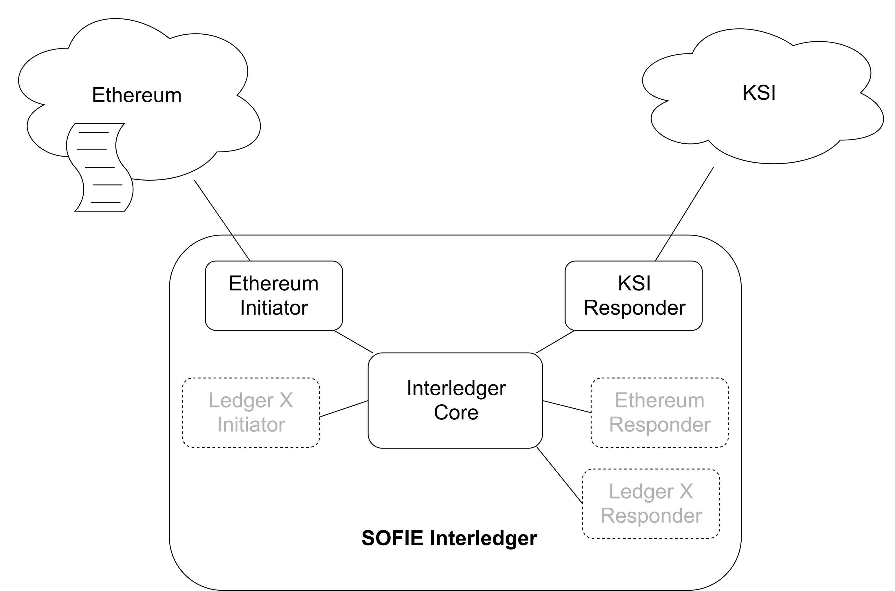
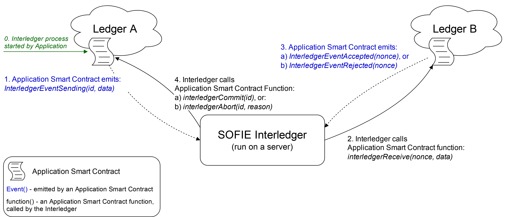

# SOFIE Interledger Component

## Table of Contents
- [Description](#Description)
    - [Architechture Overview](#Architecture-Overview)
    - [Relation with SOFIE](#Relation-with-SOFIE)
    - [Key Technologies](#Key-Technologies)
- [Usage](#Usage)
    - [Prerequisites](#Prerequisites)
    - [Installation](#Installation)
    - [Configuration](#Configuration)
    - [Execution](#Execution)
    - [Docker Images](#Docker-Images)
- [Testing](#Testing)
    - [Prerequisites for Testing](#Prerequisites-for-Testing)
    - [Running the Tests](#Running-the-Tests)
    - [Evaluating Results](Evaluating-Results)
- [Generating Documentation](#Generating-Documentation)
- [Open Issues](#Open-Issues)
- [Future Work](#Future-Work)
- [Release Notes](#Release-Notes)
- [Contact Info](#Contact-Info)
- [License](#License)

## Description

Interledger component enables activity on one ledger to trigger activity on another ledger in an atomic transaction. The ledgers can be of the same or different types (e.g. Ethereum, Hyperledger Fabric and KSI), and once triggered by a specific event, Interledger passes a customisable payload from the initiating ledger to the receiving ledger. The distributed applications utilising the Interledger component then have the flexibility to use the payload to implement any customised features.

Examples of how Interledger can be utilised include:
- [Transfering Data](/doc/example-data_transfer.rst) from one ledger to another.
- [Storing Data Hashes](/doc/adapter-ksi.md) stores detailed information in a (private) ledger and a hash of the information is then  stored in a (public) ledger at suitable intervals using Interledger to benefit from the higher trust of a public ledger.
- [Game Asset Transfer](/doc/example-game_asset_transfer.rst) example provides functionality for managing in-game assets: the assets can either be used in a game or traded between gamers. For both activities, a separate ledger is used and Interledger ensures that each asset is active in only one of the ledgers.
- [Hash Time Locked Contracts (HTLCs)](/doc/example-HTLC.md) example describes how to use the Interledger to automate the asset exchange between two ledgers when HTLCs are used.

### Architecture Overview
As shown in Figure 1, internally the Interledger component is composed of three types of elements:
- a single *core*  that manages the transactions between ledgers
- *DLT adapters (Initiators and Responders)* for different ledger types. 
- on some ledgers: an interface for a smart contract



Figure 1: internal structure of the Interledger module

Interledger component currently supports three DLT types: [Ethereum](/doc/adapter-eth.md), [Hyperledger Fabric](/doc/adapter-fabric.md) and [KSI](/doc/adapter-ksi.md). Other DLTs can be supported by [implementing adapters](/doc/Interledger_internals.rst#extending-interledger-to-support-additional-ledgers) for them. Support for additional ledgers is forthcoming as discussed in the [Future Work](#Future-Work) section.

Ledgers can function as *Initiators* that trigger transactions and as *Responders* that act based on a trigger thus creating a unidirectional data transfer from the *Initiator* to the *Responders*. However, a pair of ledgers can also be configured for bidirectional data transfer by defining both ledgers as *Initiators* and *Responders* as described in the [Configuration](#Configuration) section. 

Some ledgers may only be capable of acting in one of the roles, e.g. KSI can only act as a Responder that stores hashes as KSI cannot emit events. 

As shown in figure 2, Interledger functions by linking two ledgers, one in the *Initiator* role and one in the *Responder* role. The Interledger component is run on a server and it listens for events (*InterledgerEventSending*) from the *Initiator*, which triggers the Interledger to call the *interledgerReceive()* function on the *Responder* . Once the *Responder* is finishied processing the transaction, it emits either *InterledgerEventAccepted* event, which triggers the Interledger to call *interledgerCommit()* function of the *Initiator*, or the *InterledgerEventRejected* event, which triggers the Interledger to call the *interledgerAbort()* function of the *Initiator*.


Figure 2: using the Interledger module

On some ledgers (e.g. Ethereum and Hyperledger Fabric), the Interledger communicates with a smart contract on the ledger (so an [interface](/doc/Interledger_internals.rst#ledger-interfaces) for the smart contract is provided), while on others (e.g. KSI), no smart contract is required (or even available) and the Interledger communicates with the ledger directly.

The ability to act as the Initiator smart contract or the Responder smart contract is normally included in the application logic, but a separate proxy contracts can also be used as wrappers to interface with the Interledger module as has been done e.g. in the [Food Supply Chain pilot](https://media.voog.com/0000/0042/0957/files/sofie-onepager-food_final.pdf) (see the pilot's [smart contracts](https://github.com/orgs/SOFIE-project/projects/1) for details). 

More details of the Interledger component's implementation can be found in the [Technical description](/doc/Interledger_internals.rst).

### Relation with SOFIE
Interledger is a key component of the SOFIE Federation Architecture as it enables transactions across ledgers. It is a a standalone module that may be used by other SOFIE components and applications as necessary.


SOFIE pilots utilise the Interledger for different purposes, eg.g. the [Food Supply Chain](https://media.voog.com/0000/0042/0957/files/sofie-onepager-food_final.pdf) uses the Interledger  to automatically store hashes of the transactions on private ledgers onto a public Ethereum ledger for integrity verification, while the [Context-aware Mobile Gaming](https://media.voog.com/0000/0042/0957/files/sofie-onepager-gaming-noScreens.pdf) utilises Interledger to enforce that in-game assets are either available for gaming or being traded between gamers. 

### Key Technologies
The software modules are implemented in **Python**.
Currently the component supports the Ethereum ledger, Hyperledger Fabric and thus **Solidity** smart contracts as well as the KSI ledger.

***

## Usage

The `src/data_transfer` directory contains the code implementing the software modules of interledger and the default adapters for Ethereum, Hyperledger Fabric and KSI.

The `solidity/contracts` contains the smart contracts including the data transfer interfaces used by the component.

### Prerequisites

Software modules: **Python 3.6**.

Smart contracts: **Solidity 0.5**.

Ganache CLI and Truffle to test Interledger locally.

### Installation

The dependencies of the Interledger component can be installed with the following commands (note that it is also possible to run the component using a docker image as described in the [Docker Images](#Docker-Images) section):

```bash
python3 -m venv my-env
source my-env/bin/activate
python3 setup.py develop # Install project dependencies locally
```

The following commands also applies, espeically for external users.

```
python3 setup.py build
python3 setup.py install
```

#### Install Smart Contracts using NPM

Users who need only the essential smart contracts related to Interledger data or asset transfer interfaces and its example implementations usage have the option to use the separate [SOFIE Interledger Contracts npm module](https://www.npmjs.com/package/sofie-interledger-contracts), without the need to include this whole repository.

```bash
npm install sofie-interledger-contracts
```

This command installs the module with all the essential smart contracts of interfaces and sample implementations. These can then be extended for a custom application logic.

### Configuration
The configuration file, following the `ini` format, has three main sections:

1) `[service]`: defines the connected ledgers, `left` and `right`, and the `direction` of the data transer;
    - `direction` = `both` | `left-to-right` | `right-to-left`
    - `left` = *left*
    - `right` = *right*

2) `[left]`: indicates the `type` of that ledger and lists its options. The options depend on the specific ledger.  
    - `type` = `ethereum` | `fabric` | `ksi` | ...
    - ...

3) `[right]`: same as above.
    - `type` = `ethereum` | `fabric` | `ksi` | ...
    - ...

The `direction` can have three values:
- `left-to-right` means that interledger listens for events on the `left` ledger and transfers data to the `right` ledger. The interledger component has an `Initiator` adapter for the `left` ledger and a `Responder` adapter for the `right` ledger;
- `right-to-left` the same, but with inverse order;
- `both` means that the two interledger instances will be started (Interledger is unidirectional) to allow transfering data in both directions and that both `Initiator` and `Responder` adapters will be instatiated for both ledgers.

`left` and `right` are custom names and provide all the options needed to setup the ledgers. The available options depend on the `type` of the ledger, and more details of [Ethereum](/doc/adapter-eth.md), [Hyperledger Fabric](/doc/adapter-fabric.md) and [KSI](/doc/adapter-ksi.md) configuration options are available in their respective documents. Finally, *left* and *right* can also be the same, which can be used e.g. in testing; in that case, section 3 can be omitted.

#### Configuration Example for Ethereum

For ledger `type` =  `ethereum`, the required options are:

- **url:** the ethereum network url (localhost or with [Infura](https://infura.io/));
- **port:** if the url is localhost;
- **minter:** the contract minter (creator) address;
- **contract:** the contract address;
- **contract_abi:** path to the file describing the contract ABI in JSON format.

Example of the Interledger configuration file *config-file-name.cfg* for Ethereum, it defines two ledgers that are running locally on ports 7545 and 7546:

    [service]
    direction=both
    left=left
    right=right

    [left]
    type=ethereum
    url=http://localhost
    port=7545
    minter=0x63f7e0a227bCCD4701aB459b837446Ce61aaEb6D
    contract=0x50dc31410Cae2527b034233338B85872BE67EEe6
    contract_abi=solidity/contracts/GameToken.abi.json

    [right]
    type=ethereum
    url=http://localhost
    port=7546
    minter=0xc4C13639a867EfA9f863aF99A4c8d002E57198e0
    contract=0xba83df5f1DF4aB344240eC9F1E096790c88A216A
    contract_abi=solidity/contracts/GameToken.abi.json

For public Ethereum network external providers, such as [Infura](https://infura.io/), can be utilised to avoid running a full Ethereum node. For external providers the additional option is:

- **private_key** the private key of the minter account used to sign the transaction;

Specifically, when using the Infura endpoints, please use the websocket version only so that the events emmitted can be listened for properly. An example can be found in the `[infura]` part of the sample configuration `local-config.cfg`.

### Execution

(For local testing, ensure that local ledger instances are running, and smart contracts are deployed to them, check [testing](#Testing) section for an example.)

Run the following command:

```bash
python3 start_interledger.py config-file-name.cfg
```

Where `config-file-name.cfg` is a configuration file for the setup of the interledger component, following the previously described `ini` format.

This script will create an Interledger component instance according to the configuration file and then calls the `Interledger.run()` routine which will listen to events coming from the connected ledger(s). The script can be interrupted with: `^C`.

There are multiple examples of utilising the Interledger component:

- [CLI demo app](/demo/cli) can be used to directly interact with the Interledger component.
- A simple example for [data transfer](/doc/example-data_transfer.rst) between two ledgers, ledgers can be either Ethereum or Hyperledger Fabric and transfer between different ledgers is supported as described in [this example](/doc/example-data-transfer-HF-ETH.md).
- Interledger component supports [storing hashes](/doc/adapter-ksi.md) to the [Guardtime KSI](https://guardtime.com/technology) blockchain using [Catena DB](https://tryout-catena.guardtime.net/swagger/) service.
- The [game asset transfer](/doc/example-game_asset_transfer.rst) example show how a protocol for enforcing that in-game assets are only active in one of the connected ledgers at a time can be built on top of the Interledger.
- [Hash Time Locked Contracts (HTLCs)](/doc/example-HTLC.md) example describes how to use the Interledger to automate the asset exchange between two ledgers when HTLCs are used.


### Docker Images

Execute the script `docker-build.sh` to build a Docker image for the Interledger component. Configuration file can be provided to the image at runtime `docker run -v /path/to/config.cfg:/var/interledger/local-config.cfg interledger`.

`Dockerfile` contains multiple build targets:
- **build**: only installs dependencies
- **interledger_compose**: in addition to above, also compiles smart contracts; this target is used by the Docker Compose setup
- **run_demo**: runs Interledger command line demo
- **run (default)**: runs Inteledger component

**Docker Compose**

Docker Compose setup allows an easy usage of the Interledger [CLI demo](/demo/cli/README.md) by running `sh compose_start.sh`. Note that starting the whole setup will take some time, especially for the first time when all the necessary Docker images are build, also it is important to allow the startup script to shutdown gracefully.

The setup contains two Ganache CLI instances that act as local ledgers, the Interledger component, and the command line demo, see `docker-compose.yaml` for more details.

If there are any updates to the Interledger component, example smart contracts, `Dockerfile`, or `docker-compose.yaml`, run `docker-compose build` command to rebuild the containers.

***

## Testing

The `tests/` directory contains the scripts to test the software modules of the component, including unit tests, integration tests, and system tests, while the `solidity/test/` directory contains the tests for the smart contracts.

### Prerequisites for Testing

The easiest way to run the tests for the component is by using [Tox](https://tox.readthedocs.io/en/latest/), which will install all dependencies for testing and run all the tests. It is also possible to run the tests directly using pytest, which also allows running tests independently.

Install Tox:

```bash
pip install tox
```

Or install pytest and dependencies:

```bash
pip install pytest pytest-asyncio
```

Some of the tests assume that local Ethereum networks are running. Ganache CLI tool can be used for this:

```bash
npm install -g ganache-cli
```

To run component tests requiring local Ethereum networks, and to test example smart contracts, install Truffle:

```bash
cd solidity/
npm install
```

#### Environment

- [Truffle](https://www.trufflesuite.com/) to test the smart contracts (it includes the [Mocha](https://mochajs.org/) framework);
- The [pytest](https://docs.pytest.org/en/latest/getting-started.html) testing framework;
- The [pytest asyncio](https://github.com/pytest-dev/pytest-asyncio) library to test async co-routines.

### Running the Tests

First, local test networks need to be set up:

```bash
ganache-cli -p 7545 -b 1
ganache-cli -p 7546 -b 1
```

Here the block time is set to be one second as simulation of mining.

Afterwards, deploy the smart contracts to the local test networks:
```bash
make migrate-left
make migrate-right
```

Then, to test the component, run either:
```bash
tox
```

Or:
```bash
pytest --ignore=tests/system/test_ksi_responder.py --ignore=tests/system/test_interledger_ethereum_ksi.py --ignore=tests/system/test_timeout.py tests/
```

Read the [README](/tests/README.md) for pytest tests and test structure.

Note that testing the KSI support requires valid credentials for the Catena service. The tests can be run manually after adding credentials to `local-config.cfg`:
```bash

pytest tests/system/test_ksi_responder.py tests/system/test_interledger_ethereum_ksi.py
```

Note that testing timeout handling requires starting `ganache-cli` with `-b <blocking-time>` parameter:
 ```bash
ganache-cli -b 1 -p 7545
ganache-cli -b 1 -p 7546

pytest tests/system/test_timeout.py
```   

To test the smart contracts located in the `solidity` directory, shutdown `ganache-cli` instances (they will block the tests) and run the following (smart contracts are compiled automatically):
```bash
make test-contracts
```

### Evaluating the Results

When using Tox and Truffle, test results in JUnit format are stored in the `tests` directory. 
Files `python_test_results.xml` and `smart_contracts_test_results.xml` contain results for 
the Python and smart contracts tests respectively.

***

## Generating Documentation
A documentation file including the information provided by this readme, docs for different modules and functions (both Python and Solidity) can be generated by using the [Sphinx](http://www.sphinx-doc.org/en/master/) tool. This section provides the commands to generate documentation in HTML and PDF formats.

### Requirements
- Install dependencies for generating documentation:
```bash
pip install 'sphinx<3.0.0' m2r sphinxcontrib-httpdomain sphinxcontrib-soliditydomain sphinxcontrib-seqdiag
```

- Solidity
To generate code documentation for Solidity, install [soliditydomain](https://pypi.org/project/sphinxcontrib-soliditydomain/).

- PDF
To generate documentation in PDF format, the `latexmk` package is required to be installed. And please follow the [instructions](http://www.sphinx-doc.org/en/master/usage/builders/index.html#sphinx.builders.latex.LaTeXBuilder). **warning! Does not work if Solidity files are included. Exlude them from the documentation if you want to generate PDF documentation.**

### Generation 

- For HTML docs
```bash
make html
```

- For PDF docs via LaTeX
```bash
make latexpdf
```

### Miscs

In case a new sphinx documentation project is created:
- select **yes** when the `sphinx quickstart` command asks for `autodoc`;
- include the lines below in `doc/conf.py`:

```python
import sys
sys.path.insert(0, os.path.abspath('..'))

extensions = ['sphinx.ext.autodoc',
    'sphinxcontrib.soliditydomain',
    'sphinx.ext.coverage',
    ]

# autodoc lookup paths for solidity code
autodoc_lookup_path = '../solidity/contracts' # or any other path to smart-contracts
```

***

## Open Issues

- Each run of the module is done with empty data

This means that pending transactions from previous runs will not be considered and there is no recovery mechanism during re-start.

- Congestion of Ethereum transactions

If multiple transactions are invoked simultaneously, the (Ethereum) nonce of transactions generated by the component may be out of sync, thus making those invalid.

## Future Work

Some of the planned future improvements to the Interledger component include

- support for other ledger types.
- support for transactions over more than two ledgers.

***

## Release Notes
### 2020-08-07
#### Added
- Support for [Hyperledger Fabric](doc/adapter-fabric.md) ledger
- Example of using [Hash Time Locked Contracts (HTLCs)](doc/example-HTLC.md) with Interledger
- Support for passwords and PoA middleware for Ethereum
- [Measurement tests](/tests#performance-measurement) added for performance evaluation

#### Changed
- Performance improvements and optimizations for the Interledger core

#### Security
- Updated Truffle dependencies due to vulnerability in lodash

## Contact Information

**Contact**: Wu, Lei lei.1.wu@aalto.fi

**Contributors**: can be found in [authors](AUTHORS)


## License

This component is licensed under the Apache License 2.0.
