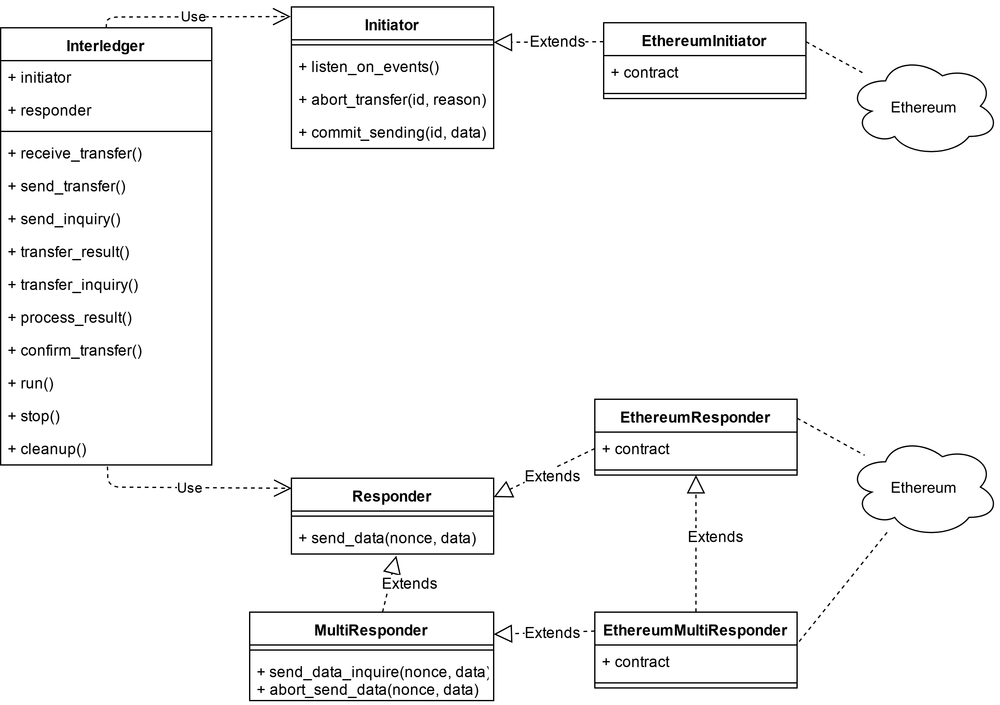
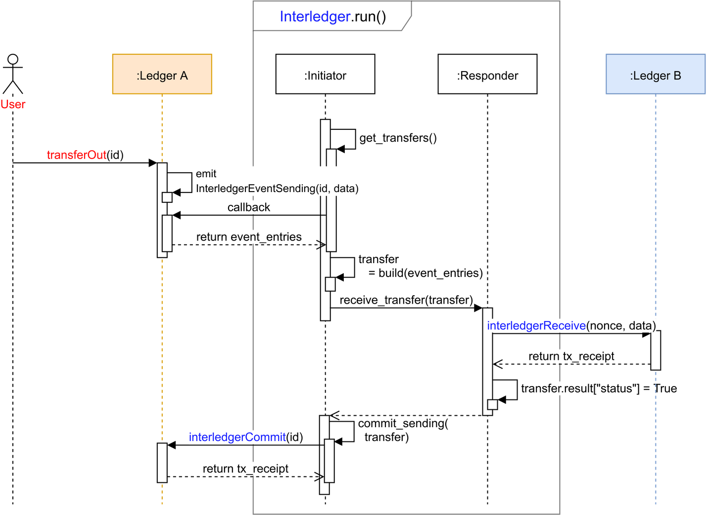

.. _interledger_internals:

==============================
Interledger: Technical Details
==============================

This document provides technical details of the Interledger component:

1. Description of `Ledger Interfaces`_ that must be implemented to be able to utilise the Interledger

2. Detailed description of the `Interledger Component`_ itself

3. Instructions about `Extending Interledger to Support Additional Ledgers`_

-----------------
Ledger Interfaces
-----------------

In order to use the Interledger component, *InterledgerSenderInterface* and *InterledgerReceiverInterface* must be implemented on ledgers, e.g. using smart contracts for Ethereum or chaincode for Hyperledger Fabric. Ethereum example for `sender`_ and `receiver`_ interfaces are provided in the `contracts`_ directory. 

.. _sender: ../solidity/contracts/InterledgerSenderInterface.sol

.. _receiver: ../solidity/contracts/InterledgerReceiverInterface.sol

.. _contracts: ../solidity/contracts

The example implementations of ledger interfaces include `DataTransceiver`_, `GameToken`_, and `HTLCEth`_. The detailed description about how the Interledger component is using ledger interfaces follows in `Detailed Overview of Interledger Protocol`_ section.

.. _DataTransceiver: ../solidity/contracts/DataTransceiver.sol

.. _GameToken: ../solidity/contracts/GameToken.sol

.. _HTLCEth: ../solidity/contracts/HTLCEth.sol

The example implementations of ledger interfaces for Hyperledger Fabric are found under  `chaincode`_ folder.

.. _chaincode: ../fabric/chaincode/src

Sender Interface
================

The sender interface contains the following events and functions:

.. code-block::

    event InterledgerEventSending(uint256 id, bytes data);

    function interledgerCommit(uint256 id) public;

    function interledgerCommit(uint256 id, bytes memory data) public;

    function interledgerAbort(uint256 id, uint256 reason) public;

``event InterledgerEventSending(uint256 id, bytes data)`` initiates the Interledger protocol. The ``id`` is the smart contract's internal identifier for the event (that the application can choose at will), while ``data`` is the data to be sent to another ledger. Solidity's ``abi.encode()`` function can be used to encode any data structure inside the ``data`` parameter.

``function interledgerCommit(uint256 id)`` and ``function interledgerCommit(uint256 id, bytes memory data)``: one of these functions will be called by Interledger to conclude a successful Interledger transaction. The ``id`` parameter is the same as in ``InterledgerEventSending`` event. The ``data`` parameter of the overloaded function is used to relay data back from the receiver, which is useful in some specific cases: for example, when storing hashes to KSI ledger, a new KSI signature id is generated, and this id will be stored to the originating ledger using the ``data`` parameter.

``function interledgerAbort(uint256 id, uint256 reason)`` will be called by Interledger to conclude a failed Interledger transaction. The ``id`` parameter is the same as above, while the ``reason`` is ``ErrorCode`` defined in `interfaces`_.

Receiver Interface
==================

The receiver interface contains the following functions and events:

.. code-block::

    function interledgerReceive(uint256 nonce, bytes memory data) public;

    event InterledgerEventAccepted(uint256 nonce);

    event InterledgerEventRejected(uint256 nonce);

    
``function interledgerReceive(uint256 nonce, bytes memory data)`` is called by the Interledger component to send data to the destination ledger. The ``nonce`` is a nonce chosen by the Interledger component (and it is not related to the ``id`` on sender side), while ``data`` is the data received from the sender.

This function should emit either the ``event InterledgerEventAccepted(uint256 nonce)`` or ``event InterledgerEventRejected(uint256 nonce)`` depending wherever it wants to accept the incoming data or not. The ``nonce`` parameter in the emitted event must match the original received ``nonce``.
    

---------------------
Interledger Component
---------------------

The Interledger component consists of the following parts as shown in Figure 1:

- One or more Initiator adapters, which are responsible for communication with the source ledger

- One or more Responder adapters, which are responsible for communication with the destination ledger

- The Interledger core, which is responsible for relaying data between the Initiator and Responder

*Figure 1: Internal structure of the Interledger module*

Currently, only a one-to-one mapping between the Initiator and Responder is supported, therefore each instance of Interledger has exactly one Initiator and one Responder. In order to support e.g. bidirectional communication between two ledgers or communication between multiple ledgers, multiple instances of the Interledger must be started as described below.

Figure 1  shows the modules implementing the Interledger component. It also shows an example using the Ethereum network as ledger (see the `Python` code for more details).

.. _Python: ../src/data_transfer

Initiator
=========

The Initiator interface is responsible for catching the ``InterledgerEventSending()`` events from a ledger and invoking the ``interledgerCommit()`` and ``interledgerAbort()`` ledger functions depending on the result of the Responder.

The functions provided by Initiator are:

* ``listen_for_events``: waits for events coming from the connected ledger;
* ``commit_sending``: calls the ``interledgerCommit()`` ledger function to finalise a transfer;
* ``abort_sending``: calls the ``interledgerAbort()`` ledger function to terminate a transfer;

Responder
=========

The Responder interface receives transfer requests from the Initiator and is responsible for relaying the transfer to the responder ledger by executing the ``interledgerReceive()`` ledger function.

The only function provided by Responder is:

* ``send_data``: receives a transfer request and calls the ``interledgerReceive()`` function of the destination ledger;

The functions ``commit_sending``, ``abort_sending`` and ``send_data`` have the following dictionary as return value:

.. code-block:: python

    {
        'status': bool,
        'tx_hash': str,
        'exception': object,# only with errors
        'error_code': Enum, # only with errors
        'message': str      # only with errors
    }

Transfer Object
===============

The ``Transfer`` object is a data structure that contains the data necessary to perform the data transfer protocol. When an event is caught, the Initiator creates a Transfer object and this objects will be modified and processed by the protocol until the data transfer it handles will be finalized or aborted. Figure in the `Interledger`_ section shows the flow of the Transfer object between the Initiator and the Responder. 

A Transfer object includes a python ``future`` object which stores the asynchrounous call to the ``Responder.send_data()`` which triggers the protocol ``interledgerReceive()`` function. As soon this call terminates and the future object has a result:

- if it is positive, i.e. the ``interledgerReceive()`` transaction was successful and ``InterledgerEventAccepted()`` was received, the Interledger will call the ``Initiator.commit_sending()`` at originating ledger;

- otherwise, Interledger will call the ``Initiator.abort_sending()`` at originating ledger.

Interledger core
================
The Interledger module functions as the core of the Interledger component.

The Interledger module creates a bridge from a ledger A to a ledger B by instantiating a Initiator listening for events coming from ledger A and executing transactions to ledger B by instantiating a Responder. To handle transfers from ledger B to ledger A, simply instantiate a second Interledger class with Initiator connected to ledger B and Responder connected to ledger A.

The functions provided by Interledger are:

* ``receive_transfer``: calls ``Initiator.get_trasfers()`` to catch events, and generate a random nonce for them. This function is blocking;
* ``send_transfer``: if there are available events, calls asynchronously ``Responder.receive_transfer()``;
* ``transfer_result``: waits for completed results from ``Responder.receive_transfer()``. This function is blocking;
* ``process_result``: if there are available results, ``commit_transfer()`` or ``abort_transfer()`` the transfer according to the result. 

The interledger exposes the ``run()`` operation to start the loop flow.

Example of loop step:

.. code-block:: python

    while True:

        receive = self.receive_transfer()
        result = self.transfer_result()

        await receive or result # wait for an event or process pending ones

        send = self.send_transfer()
        process = self.process_result()

        await send # send events to Responder, if any
        await process # process accepted events

Detailed Overview of Interledger Protocol
=========================================

The figure 2 below shows a visual representation of a transfer between ledgers:

1. The Initiator starts listening for ``InterledgerEventSending`` operations from LedgerA;

2. When the Initiator catches one, it builds a ``transfer`` to send to the Interledger;

3. For each incoming transfer Interledger generates a random nonce and forwards the transfer to the Responder;

4. The Responder calls the ``interledgerReceive()`` function to send the data to the Ledger B;

5. If the Responder receives ``InterledgerEventAccepted()`` event from Ledger B as a result of function call in step 4, the Responder sets that ``transfer.result["status"]`` status as "True";

 1. The Interledger loops over the pending transfers and, if a transfer result has its status set to "True", calls the ``commit_sending()`` function of the Responder;

 2. The Responder will finalise the transfer by calling the ``interledgerCommit()`` function in Ledger A;

6. If on the other hand the function call is step 4 fails (transaction fails, transaction results in ``InterledgerEventRejected()``, or no ``InterledgerEventAccepted()`` is received), the Responder the transfer's status to "False";

 1. The Interledger loops over the pending transfers and, if a transfer result has its status set to "False", calls the ``abort_sending()`` function of the Responder;

 2. The Responder will abort the transfer by calling the ``interledgerAbort()`` function in Ledger A;

The red and blue colors identify the caller of the transaction to a specific ledger, the caller is responsible for paying the transaction fee.

*Figure 2: Interledger protocol*

---------------------------------------------------
Extending Interledger to Support Additional Ledgers
---------------------------------------------------

Extending the Interledger component to support additional ledgers is straightforward: simply create new classes implementing the ``Initiator`` and ``Responder`` interfaces defined in the `interfaces`_ file, and add a new ledger type to the ``LedgerType`` class defined in the same file.

.. _interfaces: ../src/data_transfer/interfaces.py

As mentioned above, Initiator and Responder classes handle the communication with the ledger. the Initiator class must implement the ``listen_for_events``, ``commit_sending``, and ``abort_sending``  functions, while the Responder class must implement the ``send_data`` function.

Due to their design, it may not be possible to use all ledgers as both Responder and Initiator. For example, since KSI lacks ability to emit events, it cannot be used as the Initiator, only as the Responder. In such cases, `start_interledger.py`_ script must be modified to enforce such limitations.

.. _start_interledger.py: ../start_interledger.py
