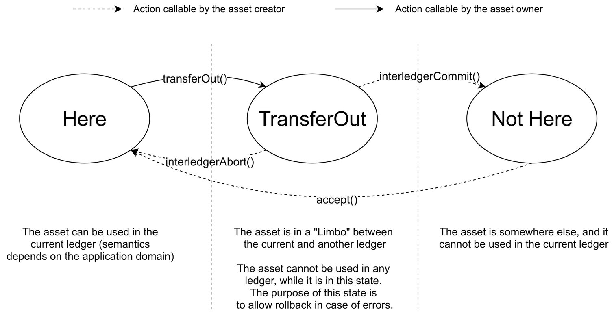
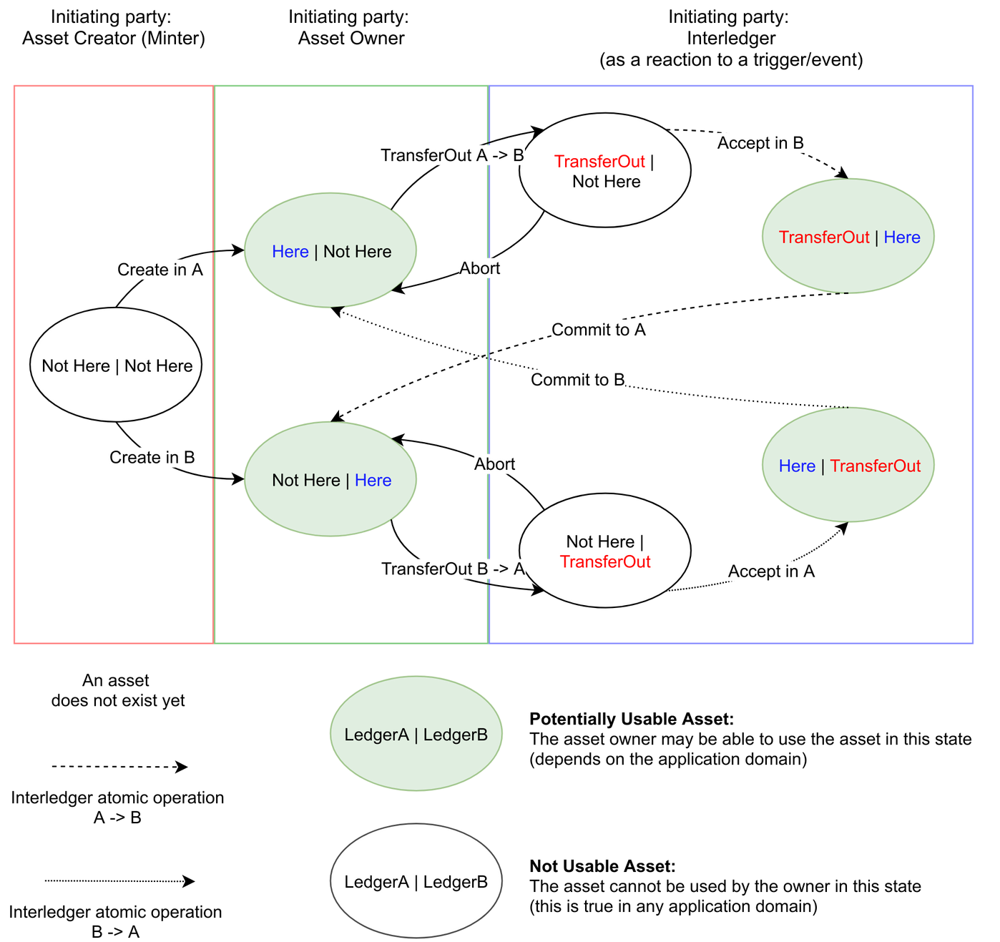

=============================================
Example: Game Asset Transfer Protocol with Interledger
=============================================

The SOFIE Interledger component can be utilized to enforce the transfer of in-game assets between two ledgers in an atomic manner.

Suppose a situation where a game uses a private ledger A to track assets used inside the game. In order to allow players to trade their assets in a flexible way, a public ledger B is used. However, if the asset is being traded, it should be not be usable inside the game as the the asset's owner may change at any moment. Therefore, the asset should be active (usable) at most in a one ledger. The Interledger component can be used to implement such functionality with a slight modification to the basic `data transfer`_ smart contract. 

An implementation of the described asset transfer protocol for Ethereum, based on `AssetTransferInterface`_, is available in `GameToken.sol`_.

.. _data transfer: ../solidity/contracts/DataTransceiver.sol

.. _AssetTransferInterface: ../solidity/contracts/AssetTransferInterface.sol

.. _GameToken.sol: ../solidity/contracts/GameToken.sol

State machine based protocol
----------------------------

Since the data stored in a ledger (such as a blockchain) cannot be removed, the transfer of ledger-based assets can be considered to be "logical": the asset has a label such as "Here" and "NotHere" to represent its "presence", or "absence", in each of the ledgers. These labels are referred to as **states**.

The `GameToken.sol`_ smart contract implements a **state machine** in order to switch the states of the assets correctly. The smart contract together with the Interledger component guarantees that an asset can have a state "Here" in at most in one of the two ledgers at any point of time.

.. _states-single:

States of an asset
^^^^^^^^^^^^^^^^^^

The figure above shows the states a single asset can have in a ledger:

- **Here:** the asset is present in that ledger;
- **TransferOut:** the asset is "moving out" from that ledger;
- **NotHere:** the asset is absent from that ledger.

In this context, we have two actors:

- **Asset creator (minter):** the entity in charge of creating (minting) new assets;
- **Asset owner:** the entity that owns an existing asset.

The creator of the asset is e.g., a gaming company, and it is the party in charge of running the Interledger component. The owner of an asset in a ledger can use it as long it is present there. To move that asset between ledgers, a cooperation between asset creator and owner is necessary to guarantee atomicity and security of the transfer operation. Each involved entity should follow a protocol, which is automated by the Interledger component.

The above figure shows also the functions used to switch between states: these will be explained in `State Interfaces`_ section.

.. _states-global:

State View
^^^^^^^^^^

The state of an asset is the composition of the states of that asset in each ledger: **(state_ledger_A, state_ledger_B)**. For example, the state of an asset can be (Here, NotHere) or (NotHere, TransferOut).

During the transfer of an asset, the following **invariant** must be preserved:

``#states("Here") = 1 or (#states("Here") = 0  &&  #states("TransferOut") = 1)``

For example (states of the asset in both ledgers are shown in parentheses):
1) (Here, Here) breaks the invariant because ``#states("Here") = 2``;
2) (TransferOut, TransferOut) breaks the invariant because ``#states("Here") = 0  &&  #states("TransferOut") = 2``.

The **exception** is when an asset does not exist: in that case, we have ``#state("NotHere") = 2``

.. _states-interfaces:

State Interfaces
^^^^^^^^^^^^^^^^

The state definition of an asset is exposed by a smart contract running in each ledger. Each smart contract should provide the following methods to switch between the proposed states:

* ``transferOut(id)``: sets the asset state to TransferOut. Callable by the asset owner;
* ``interledgerReceive(id)``: sets the asset state to Here. Callable by the asset creator (minter) to transfer asset to this ledger;
* ``interledgerCommit(id)``: sets the asset state to NotHere. Callable by the asset creator to finalize a transfer;
* ``interledgerAbort(id, reason)``: sets the asset state to Here. Callable by the asset creator to revert a transfer.

where ``id`` is an id identifying the involved asset.

Scenario 1: Successful Transfer
+++++++++++++++++++++++++++++++

An user *U* wants to transfer asset *asset1* (with id: assetId) from ledger A to ledger B.

**Precondition:** ``state(assetId) in ledger A = Here`` **&&** ``state(assetId) in ledger B = NotHere``

**Trigger:** The user *U* switches the state of *asset1* from ``Here`` to ``TransferOut`` in ledger A.
The user invokes the ``transferOut(assetId)`` operation of the smart contract.

**Action:** The Interledger component calls ``interledgerReceive()`` function from ledger B, which switches the state of *asset1* from ``NotHere`` to ``Here`` in ledger B, and emits ``InterledgerEventAccepted()`` event to signal successful reception. 

After that, the Interledger component calls ``interledgerCommit()`` function in ledger A, which de-activates *asset1* by switching its state from ``TransferOut`` to ``NotHere``.

These two operations are atomic: either both or none are finalized. At each step, **global invariant** is preserved as introduced in `State view`_ section.

**Postcondition:** ``state(assetId) in ledger A = NotHere`` **&&** ``state(assetId) in ledger B = Here``

Scenario 2: Failed Transfer
+++++++++++++++++++++++++++

An user *U* wants to transfer asset *asset1* (with id: assetId) from ledger A to ledger B.

**Precondition:** ``state(assetId) in ledger A = Here`` **&&** ``state(assetId) in ledger B = NotHere``

**Trigger:** The user *U* switches the state of *asset1* from ``Here`` to ``TransferOut`` in ledger A.
The user invokes the ``transferOut(assetId)`` operation of the smart contract.

**Action:** The Interledger component calls ``interledgerReceive()`` function from ledger B, which should set the state of *asset1* from ``NotHere`` to ``Here`` in ledger B, however this operation does not succeed (either transaction fails or  ``InterledgerEventRejected()`` event is emitted). 

After that, the Interledger component calls ``interledgerAbort()`` function in ledger A, which re-activates *asset1* by switching its state from ``TransferOut`` to ``Here``.

**Postcondition:** ``state(assetId) in ledger A = Here`` **&&** ``state(assetId) in ledger B = NotHere``

Using the Asset Transfer Functionality
--------------------------------------

The easiest way to test the Asset Transfer Functionality is to run a Interledger `CLI demo`_, which can also be run through Docker Compose setup described in the main `README`_.

.. _CLI demo: ../demo/cli/README.md

.. _README: ../README.md

For manual testing, setup and run the Interledger component as described in the main `README`_, and ensure that ``GameToken.sol`` is deployed on both ledgers, and the configuration file contains the correct address, minter, ABI entries for both ledgers.

Afterwards:

1. Mint new tokens by calling ``function mint(address to, uint256 tokenId, string memory tokenURI, bytes32 name)`` on both ledgers. The ``to`` parameter denotes the user of the token. This call must be run by the minter.

2. Set the state of one token to ``Here`` by calling ``function interledgerReceive(uint256 nonce, bytes memory data)`` on one ledger, where ``nonce`` can be any number and ``data`` is tokenId encoded with ``abi.encode()``. This call must be run by the minter.

3. Initiate the transfer by calling ``function transferOut(uint256 tokenId)`` on ledger in which the token is in ``Here`` state. This call must be run by the user.
