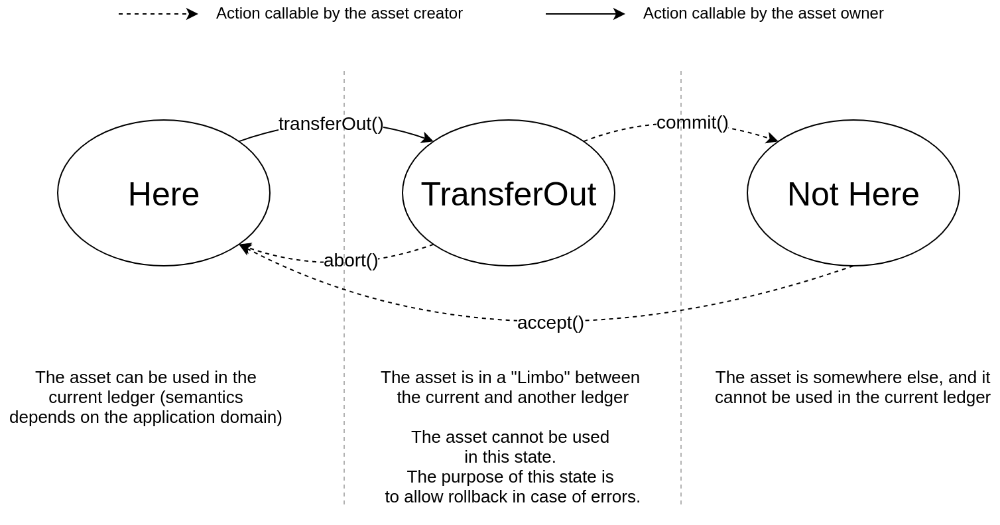
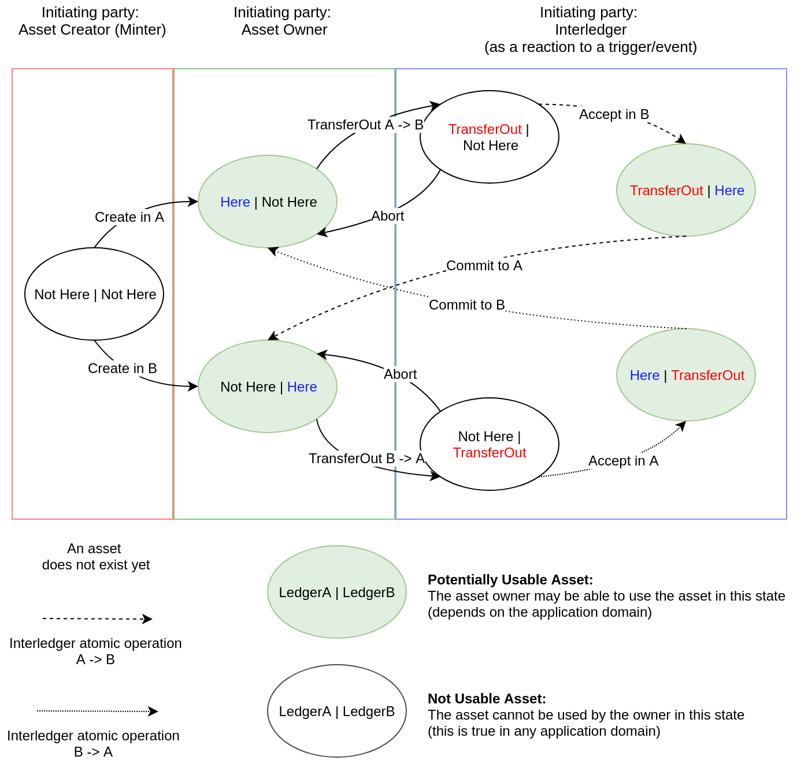
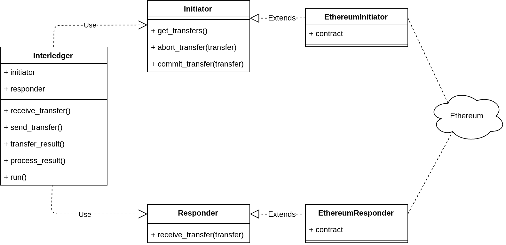
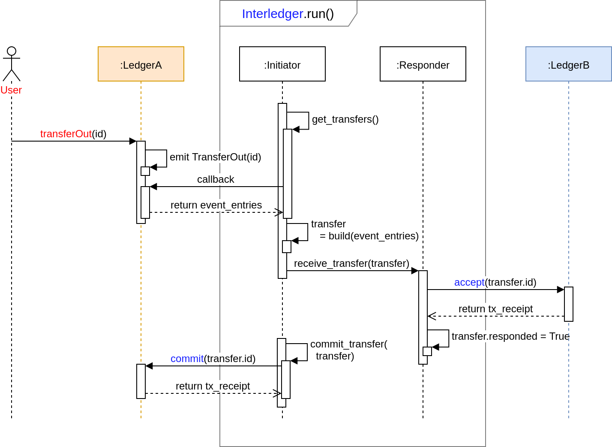

# Interledger: asset transfer protocol

In this file we introduce the asset transfer protocol provided by the SOFIE Interledger component.

**Table of contents:**

- [State machine based protocol](#state-machine-based-protocol)
    - [States of an asset](#states-of-an-asset)
    - [Interledger state view](#interledger-state-view)
    - [State interface](#state-interface)
        - [Scenario 1: succesful transfer](#scenario-1-successful-transfer)
        - [Scenario 2: failed transfer](#scenario-2-failed-transfer)

- [Component overview](#component-overview)
    - [Initiator](#initiator)
    - [Responder](#responder)
    - [The Transfer object](#the-transfer-object)
    - [Interledger](#interledger)

## State machine based protocol

This protocol implements a bridge between two ledgers (A, B).
If a certain event has been emitted in A, then Interledger will catch that and do some operation in B. 

In particular, the current use case concerns the "transfer" of an asset from ledger A to ledger B, and viceversa.

Since the data stored in a ledger (such as a blockchain) cannot be removed, the transfer of ledger-based assets can be considered to be "logical". The asset has a label such as "Here" and "NotHere" to represent its "presence", or "absence", in each of the ledgers. We refer to these labels as **states**.

The Interledger component implements a **state machine** in order to switch the states of the assets correctly. The component guarantees that an asset can have a state "Here" in at most in one of the two ledgers at any point of time.


### States of an asset



The figure above shows the states a single asset can have in a ledger:

- **Here:** the asset is present in that ledger;
- **TransferOut:** the asset is "moving out" from that ledger;
- **NotHere:** the asset is absent in that ledger.

In this context, we have two actors:
- **Asset creator (minter):** the entity in charge to create (mint) new assets;
- **Asset owner:** the entity that owns existing assets.

The owner of an asset in a ledger can use it as long it is present. To move that asset between ledgers, a cooperation between asset creator and owner is necessary to guarantee atomicity and security of the transfer operation. Each involved entity should follow a protocol, which is automated by the Interledger component.

The above figure shows also the functions used to switch between states: these will be explained in [State interface](#state-interface) section.

### Interledger state view



From interledger point of view, the state of an asset is composed by the composition of the states of that asset in each ledger: **(state_ledger_A, state_ledger_B)**. For example, the state of an asset can be (Here, NotHere) or (NotHere, TransferOut).

During the transfer of an asset, the Interledger component has to preserve this **invariant**:

``#states("Here") = 1 or (#states("Here") = 0  &&  #states("TransferOut") = 1)``

For example (states of the asset in both ledgers are shown in parentheses):
1) (TransferOut, TransferOut) breaks the invariant because ``#states("Here") = 2``;
2) (Here, Here) breaks the invariant because ``#states("Here") = 0  &&  #states("TransferOut") = 2``.

The **exception** is when an asset does not exist: in that case, we have ``#state("NotHere") = 2``

### State interface

The state definition of an asset is exposed by a smart contract running in each ledger. Each smart contract should provide the following methods to switch between the proposed states:

* ``transferOut(id)``: sets the asset state to TransferOut. Callable by the asset owner;
* ``accept(id)``: sets the asset state to Here. Callable by the asset creator (minter) to start a transfer;
* ``commit(id)``: sets the asset state to NotHere. Callable by the asset creator to finalize a transfer;
* ``abort(id)``: sets the asset state to Here. Callable by the asset creator to revert a transfer.

where ``id`` is an id identifying the involved asset.

#### Scenario 1: successful transfer

An user *U* wants to transfer asset *asset1* from ledger A to ledger B.

**Precondition:** ``state(assetId) in ledger A = Here`` **&&** ``state(assetId) in ledger B = NotHere``

**Trigger:** The user *U* switches the state of *asset1* from ``Here`` to ``TransferOut`` in ledger A.
The user invokes the ``transferOut(assetId)`` operation of the smart contract.

**Action:** The interledger activates *assetId* in ledger B by means of the ``accept()`` operation: 
this switches the state of *assetId* from ``NotHere`` to ``Here`` in ledgerB. 
After that, interledger de-activates *assetId* by switching its state from ``TransferOut`` to ``NotHere`` by means of the ``commit()`` operation in ledger A. 
These two operations are atomic: either both or none are finalized.
At each step, Interledger preserves the **global invariant** as introduced in [Interledger state view section](#interledger-state-view).

**Postcondition:** ``state(assetId) in ledger A = NotHere`` **&&** ``state(assetId) in ledger B = Here``


#### Scenario 2: failed transfer

An user *U* wants to transfer asset *asset1* from ledger A to ledger B.

**Precondition:** ``state(assetId) in ledger A = Here`` **&&** ``state(assetId) in ledger B = NotHere``

**Trigger:** The user *U* switches the state of *asset1* from ``Here`` to ``TransferOut`` in ledger A.
The user invokes the ``transferOut(assetId)`` operation of the smart contract.

**Action:** The interledger activates *assetId* in ledger B by means of the ``accept()`` operation: 
this switches the state of *assetId* from ``NotHere`` to ``Here`` in ledgerB, but
this operation does not succeed.
The protocol rollbacks to the initial state by means of the ``abort()`` operation, switching the state of *assetId* back to ``Here`` from ``TransferOut`` in ledger A.

**Postcondition:** ``state(assetId) in ledger A = Here`` **&&** ``state(assetId) in ledger B = NotHere``

***

## Component overview

The figure below shows the modules implementing the component. It also shows an example using the Ethereum network as ledger.



### Initiator

The Initiator interface is responsible to catch the events from a ledger and invoke the ``commit()`` and ``abort()`` operations depending on the result of the Responder.

The functions provided by Initiator are:

* ``get_transfers``: waits for events coming from the connected ledger;
* ``abort_transfer``: calls the ``abort()`` function to terminate the protocol of a transfer;
* ``commit_transfer``: calls the ``commit()`` function to finalize a transfer;

### Responder

The Responder interface receives transfer requests from the Initiator and is responsible to start the transfer to the other ledger by means of the ``accept()`` operation.

The only function provided by Responder is:

* ``receive_transfer``: receives a transfer request and initiate the protocol by calling the ``accept()`` function;

### The Transfer object

The ``Transfer`` object is a data structure which contains the data necessary to perform the asset transfer protocol for a particular asset.
When an event is caught, the Initiator creates a Transfer object and this objects will be modified and processed by the protocol until the asset transfer it handles will be finalized or aborted. Figure in the [Interldeger](#interledger) section shows the flow of the Transfer object between the Initiator and the Responder. 
A Transfer object includes a python ``future`` object which stores the asynchrounous call to the ``Responder.receive_transfers()`` which triggers the protocol ``accept()`` function. As soon this call terminates and the future object has a result:
- if it is positive, i.e. the ``accept()`` transaction was successfull, the Interledger will call the ``Initiator.commit_transfer()`` because the state of the asset changed;
- otherwise, the state of the asset did not chang and Interledger will call the ``Initiator.abort_transfer()`` to go back to the initial state.

### Interledger

The Interledger module creates a bridge from a ledger A to a ledger B by instantiating a Initiator listening for events coming from ledger A and executing transations to ledger B by instantiating a Responder.
To handle transfers from ledger B to ledger A, simply instantiate a second Interledger class with Initiator connected to ledger B and Responder connected to ledger A.

The functions provided by Interledger are:

* ``receive_transfer``: calls ``Initiator.get_trasfers()`` to catch events. This function is blocking;
* ``send_transfer``: if there are available events, calls asynchronously ``Responder.receive_transfer()``;
* ``transfer_result``: waits for completed results from ``Responder.receive_transfer()``. This function is blocking;
* ``process_result``: if there are available results, ``commit()`` or ``abort()`` the transfer according to the result. 

The interledger exposes the ``run()`` operation to start the loop flow.

Example of the loop step:

```python

    while True:

        receive = self.receive_transfer()
        result = self.transfer_result()

        await receive or result # wait for an event or process pending ones

        send = self.send_transfer()
        process = self.process_result()

        await send # send events to Responder, if any
        await process # process accepted events
```

The figure below shows a visual representation of a transfer between ledgers:
- The Initiator starts listening for ``transferOut`` operations from LedgerA;
- When the Initiator catches one, it builds a ``Transfer`` to send to the Responder;
- The Responder calls the ``accept()`` function to set the presence of that asset in LedgerB;
- After receiving positive respose from LedgerB, the Responder sets that ``Transfer`` as "sent";
- The Initiator loops over the pending transfers and, if a transfer has label "sent", finalize the protocol by calling the ``commit()`` function in LedgerA. 

The red and blue colors identify the caller of the transaction to a specific ledger: the caller is responsible for paying the transaction fee.


