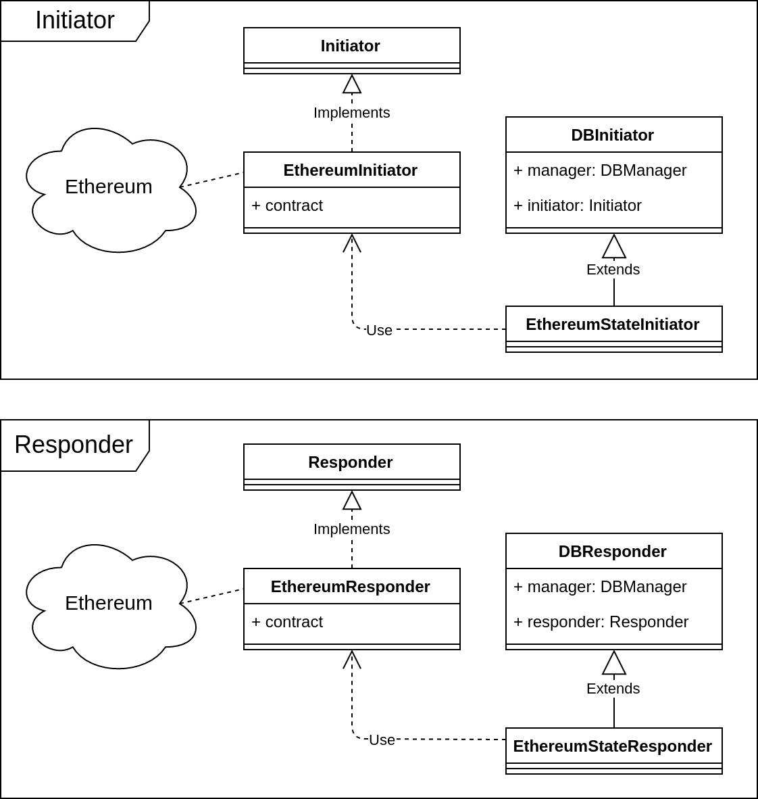

# Issue 1: State recovery

Updates done for [issue 1](https://version.aalto.fi/gitlab/sofie/open-source/interledger-asset-transfer/issues/1).

## DBManager

- Created a module `db_manager` and a class `DBManager` for the storage of the information concerning the assets. The db library used is sqlalchemy;
    - This module is in charge to define the database tables, the relationships (currently, no one) and the class provides the CRUD methods for the db;

## Initiator and Responder

- Extended `Initiator` and `Responder` inferfaces with `StateInitiator` and `StateResponder`. They provide a storage method for each operation defined in the protocol (transfer_out, commit etc) to help the testing: such methods follow the protocol nomenclature and start with `store_`. Both interfaces provide a query method to get all the assets with a given state. In particular:
    - The `StateInitiator` provides `store_transfer_out`, `store_commit` and `store_abort` to store new states in the db, and extends the parent methods `get_transfers`, `abort_transfer` and `commit_transfer` by calling the persistent storage methods if the parents methods terminate successfully. Keep in mind that `Initiator` methods lack of implementation: this depend on the ledger they are connected to (e.g. Ethereum);
    - The `StateResponder` is similar;

- Implementaed an example of the above interfaces called `DBInitiator` and `DBResponder`, storing their states in a DB. A `DBManager` instance should be injected during initialization, and each class should update one table at the time. Each one of these classes are injected with a Initiator and Responder respectively: when a protocol method will be called, such classes delegates the same method to their injected interfaces and will store the outcome in the DB if the delegated method terminates successfully. 

- Created `Interledger` subclass called `StateInterledger` accepting during initialization a `StateInitiator` and `StateResponder` objects. It defines two separate (for testing) methods for state recovery executed during iniziatlization. These methods, `restore_pending_transfers_ready` and `restore_pending_transfers_sent` read the database throught the `Initiator` and `Responder`;
    - `restore_pending_transfers_ready()` looks for all the assets in the (uncomplete) state **(TransferOut | NotHere)** (remark that an Interledger instance create a one-way bridge): it creates a set of `Transfer` objects and puts them in the correct queue used to start the protocol, called `transfers`;
    - `restore_pending_transfers_sent()` looks for all the assets in the (uncomplete) state **(TransferOut | Here)** (remark that an Interledger instance create a one-way bridge): it creates a set of `Transfer` objects flagged as COMPLETED and puts them in the correct queue used at the ending of the protocol, called `transfers_sent`;

- Implemented test cases for all listed classes.

## Ethereum example

- Implemented an Ethereum extension called `EthereumStateInitiator` and `EthereumStateResponder`: the former extends `DBInitiator` and is injected with a `EthereumInitiator` ; the latter similarly with `DBResponder` and `EthereumStateResponder`;
    - Example: when `EthereumStateInitiator.commit_transfer()` has been called, the class will call its injected `Initiator` instance, `EthereumInitiator`'s, and if successfull will keep executing; since this class extends `DBInitiator` it will store the outcome in a DB.

